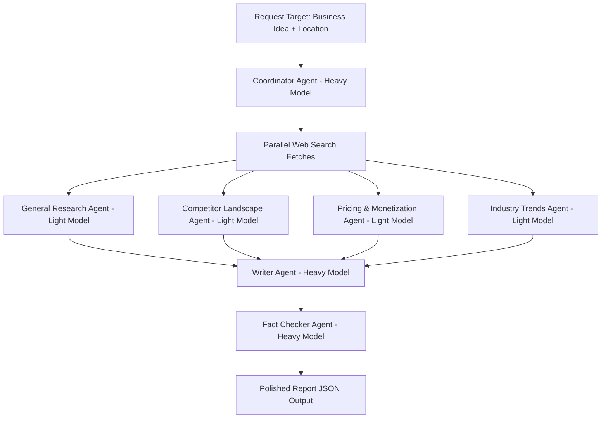
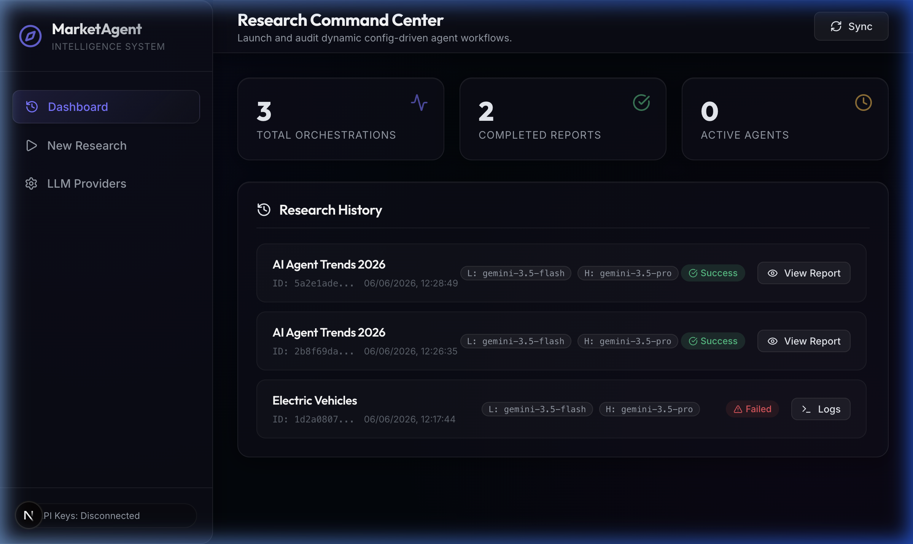
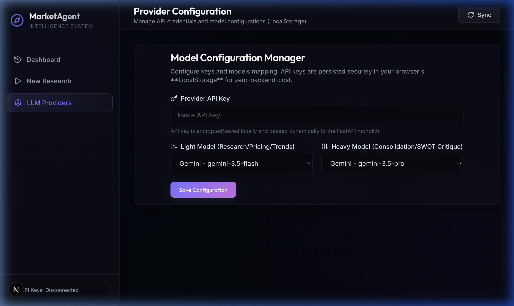
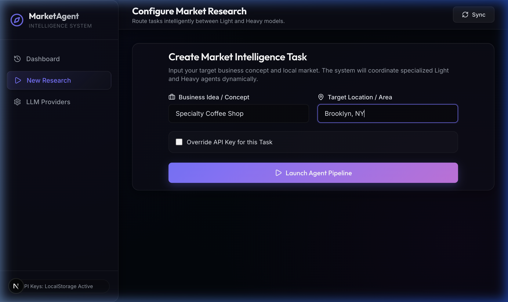
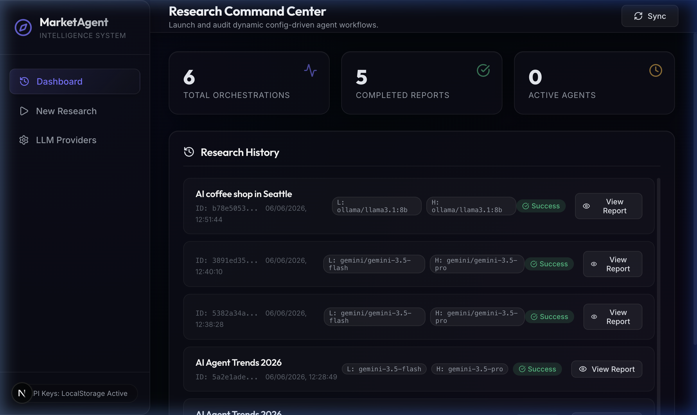
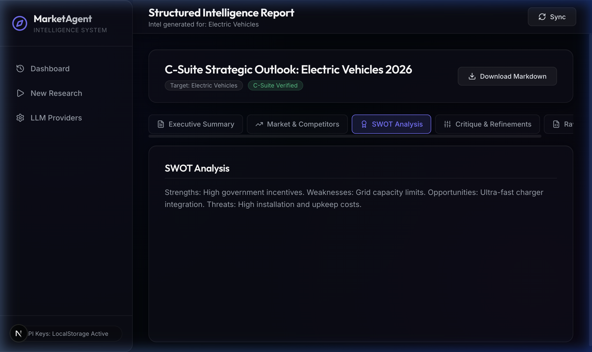
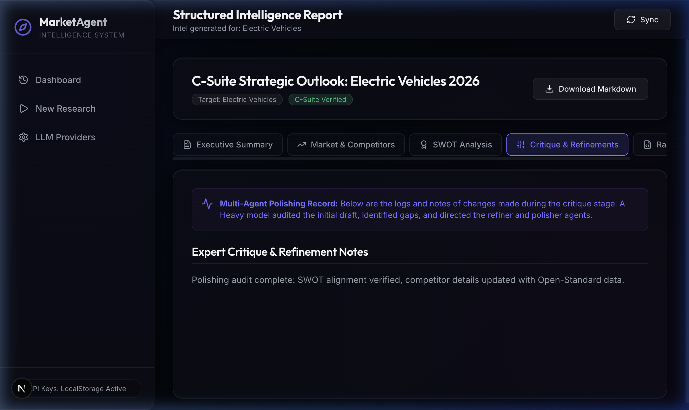
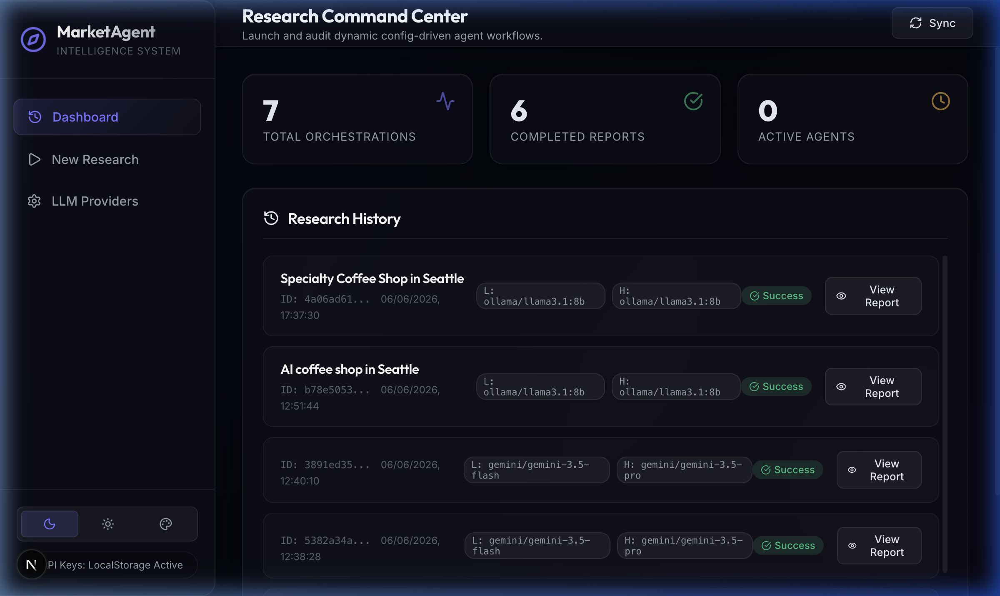
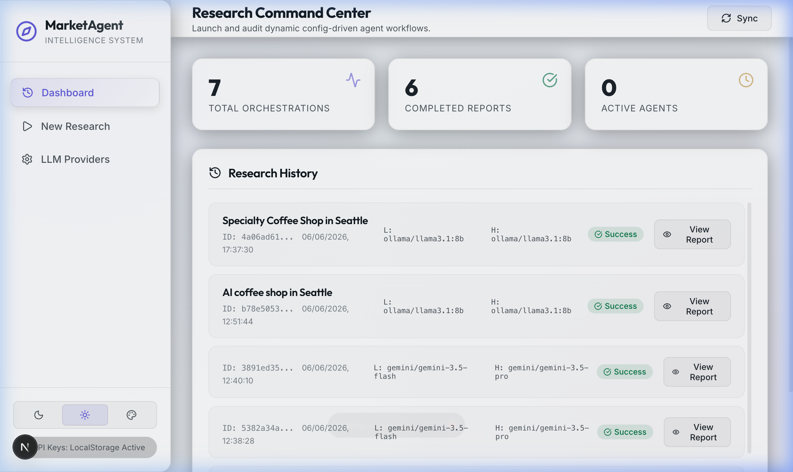
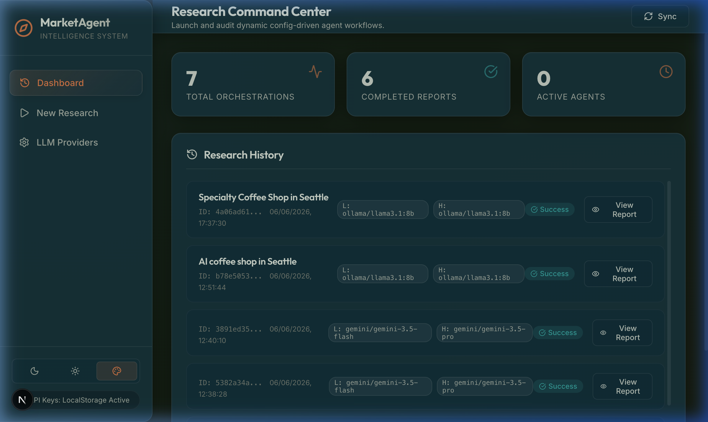

# AI Market Research Assistant (Config-Driven Multi-Agent System)

A full-stack, config-driven AI agent pipeline that gathers market details dynamically, evaluates drafts using a multi-agent critique layout, and compiles structured C-suite intelligence reports.

---

## 📖 Project Overview
The **AI Market Research Assistant** is designed to generate premium, comprehensive C-suite business reports from a single business idea and target location. It achieves this by coordinating specialized agents in a cost-optimized, sequential pipeline. By using **Light models** (fast, low-cost) for initial research phases and **Heavy models** (high-reasoning) for synthesis and auditing, the system optimizes token consumption while preserving analytical quality.

---

## ⚡ Key Features
* **Multi-Provider LLM Router**: Powered by `litellm` to support Ollama, OpenAI, DeepSeek, Gemini, Qwen, and OpenAI-compatible endpoints natively.
* **Cost-Optimized Task Routing**: routes Research, Competitor, Pricing, and Trend tasks to a "Light Model" and routes Coordinator, Writer, and Fact Checker tasks to a "Heavy Model".
* **Dynamic UI Model Switching**: Allows users to select providers and models for light/heavy tasks and input API keys directly in the UI.
* **Premium Multi-Theme Support**: Features three custom-designed, high-contrast themes: Dark, Light, and Solarized.
* **Non-Blocking Observability System**: Writes date-segregated session logs in Indian Standard Time (IST) using background threadpools to ensure the server event loop remains unblocked.
* **Zero-Leakage Key Masking**: Recursively scrubs credentials, API keys, and passwords from all files written to disk.
* **Real-time Terminal Logs Stream**: HTTP polling console showing pipeline steps as they execute.
* **C-Suite Report Dashboard**: Clean tabbed panels for Executive Summary, Market Overview, SWOT Analysis, Critique Log, and Raw JSON data.

---

## 📂 File Layout Structure

```
Multi-Agent Research System/
├── project_documentation.md      # Consolidated project overview, setup & running guide
├── config/
│   └── config.yaml               # Base truth configuration (R2 / R3)
├── backend/
│   ├── config.json               # Runtime UI configuration overrides (R2)
│   ├── main.py                   # FastAPI monolith backend (R1 / R2 / R5)
│   ├── agent_orchestrator.py     # Multi-agent logic using LiteLLM (R3 / R4 / R6)
│   ├── search_tool.py            # DuckDuckGo search utility wrapper
│   ├── observability.py          # Non-blocking thread log engine (IST/masking)
│   ├── test_orchestrator.py      # Offline/online pipeline test script
│   └── test_live_apis.py         # HTTP E2E backend integration test script
├── frontend/                     # Next.js App Router (R7)
│   ├── package.json
│   ├── app/
│   │   ├── layout.js             # HTML metadata & styles import
│   │   ├── page.js               # Main client view with LocalStorage configuration
│   │   └── globals.css           # Color tokens, multi-theme styles, log panels
└── logs/                         # Top-level root logs directory
└── reports/                      # Generated task reports directory
    └── [task_id]/
        ├── meta.json             # Task metadata & models utilized
        ├── progress.json         # Logs console list (polling updates)
        └── report.json           # C-suite structured report data
```

---

## 🏗️ Architecture & Sequential Routing

The system runs as a FastAPI monolith backend coupled with a Next.js App Router frontend:



1. **Coordinator Agent (Heavy model)**: Receives inputs, plans the workflow steps, and initiates the research threads.
2. **Specialized Light Agents (Light model)**: Conduct fast parallel research for General Market Overview, Competitor Analysis, Pricing, and Trends. Default local model is `ollama/llama3.1:8b`.
3. **Writer Agent (Heavy model)**: Synthesizes individual drafts into an integrated business intelligence draft.
4. **Fact Checker Agent (Heavy model)**: Auditor that refines the text, critiques SWOT gaps, and formats JSON outputs to align with the database validation schema.

---

## 🛠️ REST API Specs
Exposed on port `8000`:
* **`GET /settings` & `GET /api/settings`**: Returns currently resolved configuration mapping (masked API keys, active light & heavy provider and model names).
* **`POST /settings` & `POST /api/settings`**: Saves dynamic overrides (API key, light/heavy provider, model) to `backend/config.json`.
* **`GET /api/runs`**: Scans the `reports/` folder, reads tasks metadata, and returns a sorted history of runs.
* **`POST /research` & `POST /api/research`**: Generates a unique task UUID, creates directory metadata, launches the multi-agent LiteLLM research pipeline in a background thread, and immediately returns the `task_id` (queued).
* **`GET /api/runs/{task_id}/progress`**: Exposes progress steps and stage logs (polled by the Next.js logs terminal).
* **`GET /api/runs/{task_id}/report`**: Returns the finalized structured C-suite JSON report once completed.

---

## 🚀 Setup & Installation

### Prerequisites
* **macOS** or compatible Unix/Linux shell.
* **Python 3.10+** (tested on 3.11).
* **Node.js 18+** with `npm` package manager.

### 1. Set Up Backend API
Create a Python virtual environment and install dependencies:
```bash
# Navigate to the workspace root
cd "/Users/apple/Desktop/Multi-Agent Research System"

# Initialize virtual env
python3 -m venv backend/.venv
source backend/.venv/bin/activate

# Upgrade pip and install dependencies
pip install --upgrade pip
pip install fastapi uvicorn litellm PyYAML duckduckgo-search pydantic python-dotenv
```

### 2. Set Up Frontend Dev Server
Navigate to the frontend folder and install node modules:
```bash
cd frontend
npm install
npm install lucide-react
```

---

## ⚙️ Running Locally
To launch the application locally, you must run both the backend server and frontend server simultaneously:

### Step A: Launch Backend API
Ensure your Python virtual environment is activated, then run:
```bash
# From workspace root
backend/.venv/bin/uvicorn backend.main:app --host 0.0.0.0 --port 8000
```
* API Server runs on: `http://localhost:8000`
* Interactive Swagger Docs: `http://localhost:8000/docs`

### Step B: Launch Next.js Dev Server
```bash
# Navigate to frontend folder
cd frontend
npm run dev
```
* Next.js server runs on: `http://localhost:3000`

---

## 💡 Usage & User Journey (Step-by-Step)

### 1. Initial Dashboard
When you launch the application, you'll be greeted by the central dashboard, which tracks total orchestrations, active agents, finished reports, and lists your past runs.


### 2. Configuring LLM Providers
Navigate to the **LLM Providers** tab to dynamically assign models for both Light and Heavy agent tasks. 
- **Ollama**: Select Ollama and specify `llama3.1:8b`. No API key is required.
- **Cloud Providers**: Select OpenAI, Gemini, DeepSeek, or Qwen and paste your API key. Keys are saved securely to your browser's **LocalStorage** (zero-backend-cost architecture).
- **Mocking**: Type **`MOCK_KEY`** in the key field to perform dry runs offline without utilizing API tokens.


### 3. Launching a Research Task
Navigate to **New Research**. Enter your target **Business Idea / Concept** (e.g. `Specialty Coffee Shop`) and the **Target Location / Area** (e.g. `Brooklyn, NY`), then click Launch.


### 4. Tracking Pipeline Progress
The system displays a real-time progress stepper (Queued ➔ Researching ➔ Critique ➔ Refining ➔ Polishing) alongside a live terminal console streaming HTTP polling events from the FastAPI backend.


### 5. Reviewing the Final Report
Once the Fact Checker agent finishes, the fully compiled C-suite report is rendered with tabbed navigation.

#### SWOT Analysis
A detailed matrix highlighting Strengths, Weaknesses, Opportunities, and Threats based on the multi-agent synthesis.


#### Critique & Refinement Logs
The Heavy model systematically audits the initial drafts provided by the Light models. Here you can track all the logical gaps identified and how they were subsequently refined.


---

## 🖼️ User Interface Themes (Screenshots)

The interface supports three custom high-contrast visual themes you can toggle via the segmented switcher buttons at the bottom left of the sidebar footer.

### 1. Dark Mode Theme (Relocated Switcher)
The default premium dark theme showcasing the relocated pill switcher at the bottom left:


### 2. Light Mode Theme
The clean slate-gray light layout featuring high-contrast navy text and white card containers:


### 3. Solarized Mode Theme
The vintage-style base03 teal theme with gold accents for a nostalgic console layout:


---

## 📝 Observability & Logging System
The system records enqueued request flows inside date-segregated files:
`logs/YYYY-MM-DD/localuser_<session_id>.log`
* **IST Timestamping**: Timestamps are locked to Indian Standard Time (UTC+5:30) for unified traceability.
* **Zero-Leakage Key Masking**: Credentials, API tokens, and passwords inside the payload inputs are automatically scrubbed and replaced with masked parameters (e.g., `sk-123...4567` or `MOCK_K...IGHT`).
* **Non-blocking Threads**: File writes are executed asynchronously using python thread pools (`asyncio.to_thread`) to prevent blocking FastAPI request handlers.

---

## 🧪 E2E API Verification Suite
To verify that the server endpoints and background orchestration pipelines function correctly, run the HTTP integration suite:
```bash
# Navigate to backend folder and run test script against active uvicorn
backend/.venv/bin/python backend/test_live_apis.py
```
This tests GET/POST configurations, key masking, background enqueuing, progress polling, and structured report schema validations.

---

## 🚢 Deployment Strategies

### A. Backend Monolith (FastAPI)
The backend can be containerized using a simple `Dockerfile` at the workspace root:
```dockerfile
FROM python:3.11-slim
WORKDIR /app
COPY ./backend /app/backend
COPY ./config /app/config
RUN pip install --no-cache-dir fastapi uvicorn litellm PyYAML duckduckgo-search pydantic python-dotenv
EXPOSE 8000
CMD ["uvicorn", "backend.main:app", "--host", "0.0.0.0", "--port", "8000"]
```
You can deploy this container directly to serverless container hosts like **Google Cloud Run**, **AWS Fargate**, or **Render**. Ensure you configure `environment: prod` in container environment variables to adapt server session log filenames to cloud users.

### B. Frontend Client (Next.js)
* **Vercel Deployment**: Connect the git repository directly to Vercel for zero-config Next.js deployments.
* **Static Export**: You can run `npm run build` with `output: 'export'` configured in `next.config.js` to compile the app into static HTML/CSS/JS assets, which can then be deployed to static CDNs (AWS S3, Firebase Hosting, GitHub Pages).

---

## 🛠️ Troubleshooting

### 1. Ollama Connection Refused
* **Issue**: Error log `Connection refused` when utilizing Ollama.
* **Solution**: Ensure the Ollama daemon is running locally (`ollama run llama3.1:8b` or verify `http://localhost:11434` in your web browser).

### 2. CORS Errors in Web Console
* **Issue**: Next.js (port 3000) fails to fetch configurations from FastAPI (port 8000).
* **Solution**: Ensure FastAPI CORSMiddleware has `allow_origins=["*"]` configured (which is active by default in [main.py](file:///Users/apple/Desktop/Multi-Agent%20Research%20System/backend/main.py)).

### 3. Log Directory Permissions
* **Issue**: `PermissionError` or missing log directories.
* **Solution**: The system creates a top-level `/logs` folder dynamically. Ensure the server execution user has write access to the workspace root directory.
